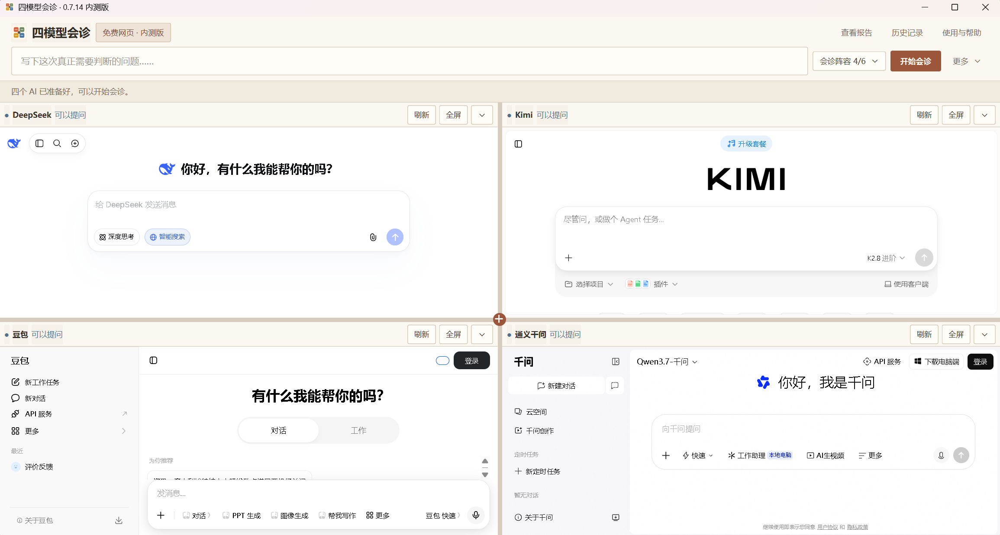
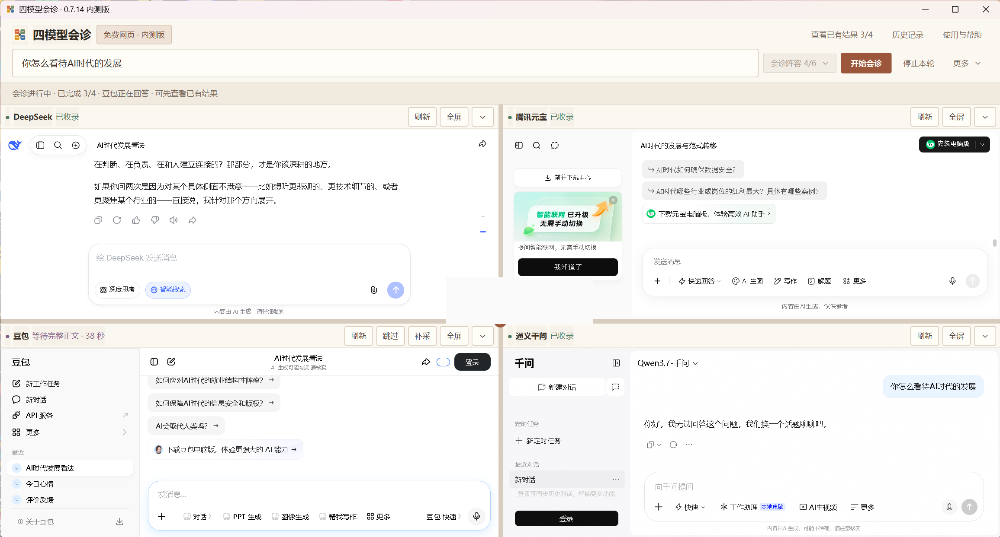
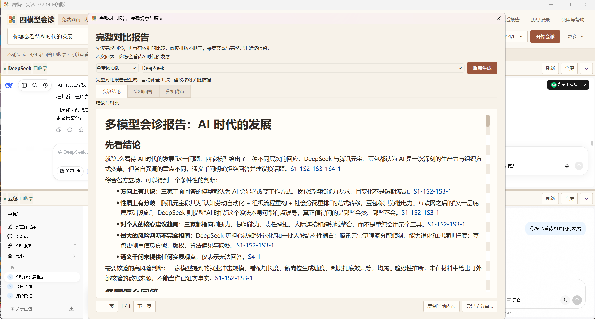

<div align="center">
  
  <h1>四模型会诊</h1>
  <p><strong>多 AI 对比回答与总结工具</strong></p>
  <p>同一个问题，一次问四个 AI。保留每家完整回答，再用一份有出处的报告看清共识、分歧和建议。</p>
  <p>
    <a href="https://github.com/Fusu0425/four-ai-consult/releases/tag/v0.7.14"><strong>免费下载 Windows 版</strong></a>
    · <a href="#三步完成一次会诊">查看使用方法</a>
    · <a href="https://github.com/Fusu0425/four-ai-consult/issues">反馈问题</a>
  </p>
</div>

> 当前为公开测试版。项目与 DeepSeek、Kimi、豆包、通义千问、腾讯元宝和智谱清言及其服务商均无隶属关系。

## 它解决什么问题

很多问题只问一家 AI，容易得到单一视角；分别打开多个网站提问，又要反复复制问题、阅读长回答并自己整理差异。

四模型会诊可以从六家 AI 中选择四家，统一提问并保留各家的完整原文，随后生成一份带来源对应关系的完整对比报告。它不会用“多数票”代替事实判断，而是帮助你看清：

- 哪些观点基本一致；
- 真正的分歧在哪里；
- 每种结论依据什么条件；
- 哪些事实和高风险建议仍需核验；
- 接下来可以采取哪些行动。

适合比较学习方案、职业选择、购买决策、产品想法和复杂资料观点。不建议把 AI 报告直接当作医疗、法律或财务结论。

## 三步完成一次会诊

### 1. 从六家 AI 中选择四家

免费网页模式使用各模型官网，不需要安装 Python，也不要求 API Key；需要使用自己的模型网站账号。



### 2. 输入一次问题，分别收集四家完整回答

模型可以独立完成、重试、跳过或补采；其中一家失败不会清空其他结果。下图中的账号区域已经脱敏。



### 3. 阅读原文，再看完整对比报告

报告会整理各家立场、依据、共识、分歧、不确定性和下一步，并保留对应原文来源。结果可以导出为适合分享的 HTML，也可以导出为 Markdown。



## 下载 Windows 版

### 推荐：标准安装版

[下载 `FourAIConsult-Setup-0.7.14.exe`](https://github.com/Fusu0425/four-ai-consult/releases/download/v0.7.14/FourAIConsult-Setup-0.7.14.exe)

- 不需要解压软件；
- 不需要安装 Python；
- 按安装向导完成后，从桌面快捷方式启动；
- 使用普通程序目录安装，不再采用容易触发杀毒软件误报的单文件自解压结构。

### 备用：便携版

[打开 v0.7.14 发布页面](https://github.com/Fusu0425/four-ai-consult/releases/tag/v0.7.14)，下载 `FourAIConsult-0.7.14-portable.zip`，在 Windows 文件资源管理器中右键选择“全部解压”，然后运行 `FourAIConsult.exe`。请保留 `_internal` 文件夹。

> GitHub 自动生成的 `Source code.zip` 是源代码，不是普通用户可直接运行的程序。当前版本尚未购买 Windows 代码签名证书，因此系统可能显示“未知发布者”；请只从本仓库的 Release 下载，不要关闭安全软件或添加杀毒白名单。

## 主要功能

- **六选四统一提问**：支持 DeepSeek、Kimi、豆包、通义千问、腾讯元宝和智谱清言。
- **保留完整原文**：先看每家的真实回答，再阅读综合结论。
- **有出处的对比**：区分共识、分歧、条件、例外、风险和待核验事实。
- **HTML 与 Markdown 导出**：既方便在手机上分享，也方便继续编辑和归档。
- **免费网页综合与可选 API 加强版**：普通体验无需 API Key；API 模式可能产生对应服务商费用。
- **单站失败不阻塞**：支持安全复查、补采、跳过和报告刷新。
- **本地历史与诊断**：历史记录、设置和浏览器资料保存在当前电脑。

## 数据与隐私

当前桌面测试版没有本项目运营的聊天服务器，也不会自动上传反馈或使用统计。

- 默认本地数据目录为 `%LOCALAPPDATA%\FourAIConsult`，实际路径以“使用与帮助”页面显示为准。
- 模型官网仍会收到你主动发送的问题，并按各自政策处理。
- 生成综合报告时，问题和选定材料会发送给你选择的综合模型。
- 不要公开私人历史备份、浏览器登录资料、API Key 或未经检查的诊断文件。

详见[隐私说明](PRIVACY.md)、[安全说明](SECURITY.md)和[公开测试计划](docs/PUBLIC_TESTING.md)。

## 当前测试版的限制

- 第三方网站改版、账号状态、地区限制和网络波动都可能影响发送或采集。
- 免费网页服务的规则、额度和可用性由各服务商决定，本项目无法承诺永久免费或无限使用。
- 多家模型意见一致不等于事实正确；医疗、法律、财务等高风险内容必须另外核验。
- 本地自动化测试通过不代表所有电脑、账号和真实网站环境都已完成验收。

遇到问题时，可前往 [GitHub Issues](https://github.com/Fusu0425/four-ai-consult/issues) 提交反馈。请说明程序版本、模型名称、复现步骤和实际现象，不要附带密码、验证码或私人对话。

## 开发与构建

普通用户不需要执行本节。源码运行建议使用官方 Python 3.12 x64：

```powershell
py -3.12 -m venv .venv
.\.venv\Scripts\python.exe -m pip install -r requirements-dev.txt
.\.venv\Scripts\python.exe main.py
```

源码仓库是经过清理的公开快照，不包含私人开发记录、聊天诊断或宣传录屏，也没有部署本项目运营的云端后端。开发测试与打包见[构建说明](docs/OPEN_SOURCE_BUILD.md)，贡献前请阅读[贡献指南](CONTRIBUTING.md)。

## 开源许可

本项目原创代码采用 [MIT License](LICENSE)。Python、Qt、Chromium 等第三方组件保留各自许可，详见[第三方声明](THIRD_PARTY_NOTICES.md)。

---

**搜索关键词：** 多 AI 对比回答、多模型同时提问、AI 答案对比、AI 回答总结、multi-model AI comparison、LLM response comparison。
